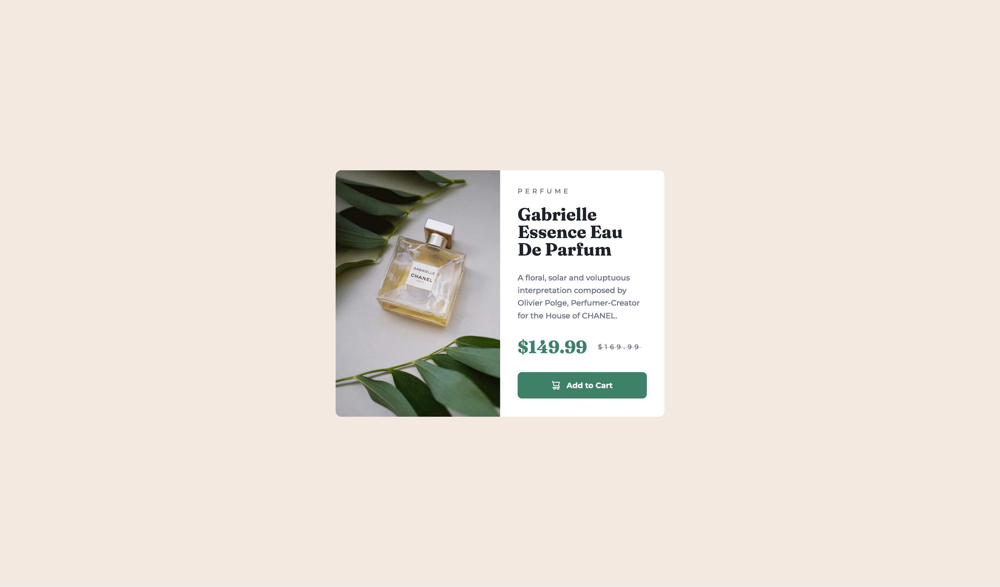

# Frontend Mentor - Product preview card component solution

This is a solution to the [Product preview card component challenge on Frontend Mentor](https://www.frontendmentor.io/challenges/product-preview-card-component-GO7UmttRfa). Frontend Mentor challenges help you improve your coding skills by building realistic projects.

## Table of contents

- [Overview](#overview)
  - [Screenshot](#screenshot)
  - [Links](#links)
- [My process](#my-process)
  - [Built with](#built-with)
- [Author](#author)
- [Acknowledgments](#acknowledgments)

## Overview

This is the first challenge from the "Building Responsive Layouts" learning path. It features a clean, modern design with a subtle, minimalist animation on the CTA button.

The design encourages a focus on responsiveness, with the component optimized for both mobile and desktop.

Overall, it's a good project and a great opportunity to learn.

### Screenshot

### Links

- Solution URL: [Product Preview Card Component - GitHub Repo](https://github.com/dealencardavid/product-preview-card-component_frontendmentor)
- Live Site URL: [Product Preview Card Component Live](https://dealencardavid.github.io/product-preview-card-component_frontendmentor/)

## My process

### Built with

- Semantic HTML5 markup
- CSS custom properties
- Flexbox
- CSS Query Selector

## Author

- Frontend Mentor - [@dealencardavid](https://www.frontendmentor.io/profile/dealencardavid)
- GitHub - [@dealencardavid](https://github.com/dealencardavid)

## Acknowledgments

Hats off to FrontendMentor for enabling goood resources to new frontend developers!
